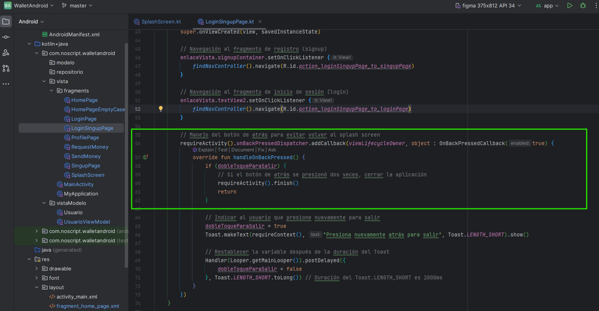

# Primera app Android Studio

La idea de este de este ejercicio es que primero conozcamos la interfas de Android Studio, luego aprender a realizar vistas en varias formas de xml orientadas a aplicaciones android, como en este caso `LayerLayout` y `Constraint Layout`.

Se nos entrego un proyecto en la web Figma, esta web guarda las vistas de la aplicacion con medidas en pixeles, se me ocurrio hacer coincidir el lienzo de la pantalla en Android Studio con el lienzo de Figma para evitar hacer coincidir las relaciones que indica esta web vs dp que es la medida utilizada en el IDE.

Luego de esto selecciono en la vista de edicion a este disposivo virtual para que muestre el lienzo.

Es importante ejecutar en el dispositivo correcto, esto se hace seleccionandolo en la barra sobre esto, como en la siguiente imagen.

## Ventanas recreadas

Esta semana nos toco como meta recrear estas dos ventanas y mantener las relaciones y tamaños, otro aspecto extra era realizar esto evitando que el diseño se dañe al girar la pantalla.

### Primera venta en `LayerLayout`

### Segunda ventana en `Constraint Layout`

## Aplicacion ejecutandose desde celular

## TAREA INTEGRADORA 5

A continuacion indicare todo lo que fue implementado en esta etapa del wallet para permitir una facil revision de la misma.

Agregue un directorio llamado vistaModelo para manejar los datos locales del usuario que cree su cuenta y utilice la aplicacion.

Otro punto del que tuve que tomar cuenta fue revisar los codigos de mis xml ya que en la entrega anterior algunas vistas se descuadraron, esta vez para prevenir este problema implemente ScrollView lo cual permite que si los elementos superan el espacio disponible en una pantalla mas pequeña se permita un scroll para seguir leyendo los componentes fuera de la vista.

Me toco revisar el codigo xml del nav_graph ya que algunos nombres de acciones no estaban bien ubicados y dos acciones no estaban implementas, llas cuales son las indicadas con el siguiente rectangulo 

ahora con ese pequeño cambio exte la accion de cambiar entre el fragment_login_page.xml al fragment_singup_page.xml y viceversa.

El MainActivity.kt solo se encarga de indicarle al MainActivity.xml cual es el fragment que sera cargado al inicio de la app y tambien depende de lo que el usuario elija en pantalla, veo necesario en un futuro permitir que el usuario deje iniciada su sesion en caso que se cierre la aplicacion y que en el main o en otro directorio distinto manejar la logica que realice esta accion detectando el estado de la sesion en el archivo Usuario.kt

En este archivo ubicado en el directorio vistaModelo quise guardar los datos de inicio de sesion.

Pero antes de nada, es importante que la aplicacion se sienta viva, por eso en SplashScreen.kt agregue que este fragment se muestre durante algunos segundos al abrir la aplicacion

Despues de esto se muestra la pagina que le permite al usuario elegir si quiere crear una cuenta o bien, iniciar sesion en una cuenta ya existente. Esa logica esta presente en las siguientes lineas de LoginSingupPage.kt

tambien evito que se pueda volver con el boton atras a el SplashScreen.kt

y bajo ese codigo implemento algo que e visto en varias app que piden una confirmacion para salir de las mismas, esto es realizado con un Toast para el aviso y una especie de temporizador.

ya habiendo logrado la logica de esta ventana, puede concentrarme en lo siguiente, que era decidir que afronto primero, el login o el singup, puesto que no existe forma de iniciar sesion sin un usuario creado, empece por la logica del fragment que logra esto, el SingupPage.kt

en un principio tenia nombres no tan descriptivos en mi xml, asi que les hice un refactor cambio de nombre y active un listener para que puedan ser detectados 

agregue logica para que se le exijan algunas cosas al usaurio antes de poder crear al usuario, la primera es que la contraseña debe ser minimo de 10 caracteres, que ambos campos donde se escribe la contraseña sean iguales y que se deben rellenar todos los campos antes de aceptar los datos ingresados.

falta logica que exija solo letras (para todo excepto la contraseña) y que se verifique que el campo de correo tenga la estructura que tienen todos los correos donde sale el usuario, simbolo, servidor y dominio.

Todos los avisos y comprovaciones preferi hacerlos por Toast ya que asi no debo modificar los fragments

