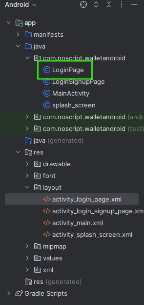

# Desarrollo de vistas

Desde este punto en adelante seguire con el desarrollo de las vistas para la entrega del wallet android, intentare utilizar los metodos que se nos van indicando en clases para practicarlos e integrarlos en mi flujo de trabajo.

## Enunciados

Estos seran extractos de el archivo [pdf](Evaluación%20del%20módulo%204-1.pdf) que fue compartido en el modulo 4 como tarea integradora.

```markdown
Evaluación del módulo 4

Proyecto Alke Wallet

Situación inicial 📍

Como parte de un equipo de programadores recibiste el pedido de una
importante empresa financiera, de desarrollar una billetera virtual,
conocida como Alke Wallet. La cual permitirá a sus usuarios tener un
seguimiento de sus tarjetas y sus gastos, y realizar pagos virtuales.
Nuestros diseñadores ya tienen un modelo de diseño y elementos que
necesita esta wallet, con las cuales podrás guiarte para generar las
pantallas directamente en Android Studio.
Te dejamos el trabajo de los diseñadores realizado en Figma, lo encontrarás
en el apartado de recursos..

Nuestro objetivo 📋

En este proyecto tendrás que crear varias pantallas de nuestra wallet, como
por ejemplo la portada, el inicio de sesión, el registro, y varias más
relacionadas a las acciones que pueden realizar en la aplicación. Te vamos
a dejar todos los diseños y descripciones, vos tendrás que manejarte entre
figma y Android Studio para desarrollar estas pantallas. Es importante
aclarar que solo las crearemos, y serán independientes entre sí, es decir
que no las conectaremos entre ellas. Ya que no vimos esos conceptos en
este módulo.

Al finalizar, tu proyecto deberá estar cargado en la plataforma GitHub.

Requerimientos 🔧 

A continuación vamos a mostrarte cuales son las pantallas que deberás crear
como un requerimiento general. Luego en el requerimiento técnico, veremos
cuestiones de código y te daremos algunos tips que te ayudarán a la creación.
Antes de comenzar recuerda ya tener preparado tu proyecto, y tu cuenta en
GitHub, ya que deberás tener un repositorio con el proyecto cargado.

● Requerimientos generales

1. Tener tu proyecto creado, recorda que sea uno totalmente nuevo.

2. Tener tu cuenta en GitHub

3. Crear el código de las siguientes pantallas, en el orden que te mostramos:

a. Splash Screen
b. Login / Signup Page
c. Login Page
d. Signup Page
e. Home Page
f. Home Page - Empty Case
g. Profile Page
h. Send Money
i. Request Money
```

Ya que las pantallas `Splash Screen` y `Login / Signup Page` ya fueron creadas [anteriormente](README.md), continuare con el desarrollo de las demas pantallas.

## Login Page

Lo primero es crear un archivo java en el directorio `com.noscript.walletandroid` con el nombre `LoginPage`, para esto en las opciones mostradas se usara la opcion `Empty Views Activity`:


Este paso creara los archivos necesarios, incluido el `activity_login_page.xml` en el cual podremos ir editando la vista deacuerdo al tipo de layout que creamos mas conveniente, de todas formas siempre es mejor utilizar la codificacion mas nueva ya que con el tiempo el resto puede dejar de estar disponible ademas de contar con codigos mas refinados.



La vista que debemos realizar es la siguiente:


